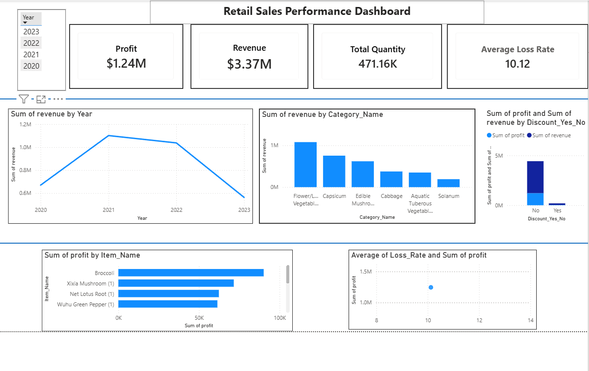

# 🛒 Retail Sales Analysis

> An end-to-end data analysis project uncovering revenue trends, product profitability, discount impact, and loss rate patterns across 878,000+ retail transactions.

---

## 📌 Table of Contents

- [Overview](#overview)
- [Dataset](#dataset)
- [Tech Stack](#tech-stack)
- [Project Workflow](#project-workflow)
- [Key Business Questions](#key-business-questions)
- [Key Insights](#key-insights)
- [Dashboard Preview](#dashboard-preview)
- [Project Structure](#project-structure)

---

## Overview

This project follows a complete end-to-end data analysis pipeline — from raw data ingestion and SQL-based cleaning, through Python-powered exploratory analysis, to an interactive Power BI dashboard. The goal is to turn raw retail transaction records into actionable business insights around revenue performance, product profitability, discount strategies, and inventory loss.

---

## Dataset

- **Source:** Kaggle
- **Size:** 878,000+ sales records
- **Content:**

| Field | Description |
|---|---|
| Product Information | Name, category, SKU |
| Sales Transactions | Date, quantity, discount, revenue |
| Wholesale Prices | Cost basis for profit calculation |
| Loss Rates | Product-level shrinkage/waste rates |

---

## Tech Stack

| Layer | Tools |
|---|---|
| Data Storage & Querying | SQL Server |
| Data Cleaning & EDA | Python — Pandas, Matplotlib |
| Notebook Environment | Jupyter Notebook |
| Dashboard & Reporting | Power BI |

---

## Project Workflow

### 1. Data Preparation — SQL

Raw CSV files were imported into SQL Server and transformed into structured, analysis-ready tables.

Tasks performed:
- Data type correction and null handling
- Table joins across products, transactions, and pricing data
- Revenue and profit calculation logic
- Created a centralized SQL view `sales_summary` as the single source of truth for all downstream analysis

### 2. Exploratory Data Analysis — Python

Python was used to explore and visualize patterns in the data across multiple dimensions:

- Revenue trend analysis over time
- Category-level performance comparison
- Product-level profitability ranking
- Discount impact on margins
- Loss rate distribution and its relationship to profit
- All visualizations produced with **Matplotlib**

### 3. Dashboard Development — Power BI

An interactive Power BI dashboard was built to monitor KPIs and enable self-serve exploration.

Dashboard components:
- **KPI Cards:** Total Revenue, Total Profit, Quantity Sold, Average Loss Rate
- **Revenue Trend:** Time-series chart with period-over-period comparison
- **Category Breakdown:** Top categories by revenue and profit
- **Product Ranking:** Most and least profitable products
- **Discount Analysis:** Revenue and profit by discount tier
- **Loss Rate vs. Profit:** Scatter plot to explore the relationship

---

## Key Business Questions

1. Which product categories generate the highest revenue?
2. Which products are the most profitable?
3. How do discounts affect revenue and profit margins?
4. Is there a relationship between product loss rate and profitability?
5. How does revenue evolve over time, and what drives the spikes?

---

## Key Insights

- 🥬 **Flower/Leaf Vegetables** was the top revenue-generating category across the dataset.
- 💸 **Discounted sales** consistently showed lower average profit margins compared to full-price transactions.
- ⚠️ **Several products ran at negative profit** despite having low loss rates — pointing to pricing or cost issues rather than shrinkage.
- 📉 **No strong correlation** was found between loss rate and profitability, suggesting loss rate alone is not a reliable profitability predictor.
- 📈 **Revenue spikes** occurred during specific periods, likely linked to seasonal demand or promotional events.

---

## Dashboard Preview

### Revenue & KPI Dashboard

> 

---

## Project Structure

```
retail-sales-analysis/
│
├── data/                  # Raw and cleaned datasets
├── sql/                   # SQL scripts and views (including sales_summary)
├── python/                # Jupyter notebooks and EDA scripts
├── powerbi/               # Power BI .pbix dashboard file
├── images/                # Dashboard screenshots and chart exports
└── README.md
```

---

## Getting Started

1. **SQL:** Import the CSVs in `/data` into SQL Server and run the scripts in `/sql` to create the `sales_summary` view.
2. **Python:** Open the notebooks in `/python` using Jupyter. Install dependencies with:
   ```bash
   pip install pandas matplotlib
   ```
3. **Power BI:** Open the `.pbix` file in `/powerbi` and point the data source to your `sales_summary` SQL view.

---

*Built with SQL Server · Python · Power BI*
